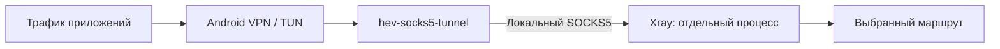

<div align="center">


<h1>SimpleXray</h1>

<p>Android-клиент Xray с гибкой маршрутизацией, SplitDNS и ручной настройкой серверов.</p>

<p>
  
  
  <a href="LICENSE"></a>
</p>

<p>
  <a href="https://github.com/IvanTopGaming/SimpleXray/releases"><b>Скачать APK</b></a>
  · <a href="#установка">Быстрый старт</a>
  · <a href="#как-запускается-xray">Как устроено</a>
  · <a href="metadata/ru-RU/changelogs">Изменения</a>
  · <a href="https://github.com/IvanTopGaming/SimpleXray/issues">Сообщить об ошибке</a>
</p>

</div>

---

## Возможности

Импортируй подписку или настрой сервер вручную. Выбери основной профиль,
задай правила маршрутизации и направь нужные домены через отдельные серверы.

| Раздел | Что можно настроить |
| --- | --- |
| **Серверы и подписки** | Импорт, обновление подписок, проверка доступности и ручной ввод параметров подключения |
| **Роутинг** | Правила по доменам, IP, GeoSite и GeoIP; отдельный сервер для каждого пользовательского блока |
| **DNS** | Основной и резервный резолверы, FakeIP и SplitDNS; отдельный DNS для прямых доменов |
| **Приложения** | VPN для всех приложений, только выбранных или с исключениями |
| **Профиль и JSON** | Просмотр итогового конфига и переопределение секций `log`, `dns`, `routing`, `policy`, `stats` |
| **Журнал и статистика** | Логи ядра, скорость соединения и объём переданного трафика |

В уведомлении доступны имя сервера, домен подписки, скорость, трафик и кнопка
отключения. Автоподключение после перезагрузки включается в настройках.
Также доступны локальные SOCKS- и HTTP-прокси.

### Протоколы

**VLESS** · **VMess** · **Trojan** · **Shadowsocks / SS2022** · **SOCKS** · **HTTP** · **WireGuard** · **Hysteria 2**

Ручная форма показывает поля выбранного протокола: адрес, учётные данные,
транспорт, TLS/REALITY и дополнительные параметры подключения.

## Установка

1. Открой [Releases](https://github.com/IvanTopGaming/SimpleXray/releases) и скачай подходящий APK.
2. Установи приложение, затем добавь сервер или подписку.
3. Выбери сервер и нажми **«Подключить»**.
4. Разреши Android создать VPN-подключение.

Требуется **Android 10 или новее**.

| Файл | Архитектура |
| --- | --- |
| `simplexray-arm64-v8a.apk` | ARM64 |
| `simplexray-x86_64.apk` | x86_64 |
| `simplexray-universal.apk` | ARM64 и x86_64 в одном APK |

## Маршрутизация

Правила разделены на блоки. Перемещай их стрелками: первое совпадение определяет
маршрут. Настройка **«Остальной трафик»** задаёт маршрут для остальных адресов.

| Блок | Маршрут |
| --- | --- |
| **Напрямую** | Прямое соединение |
| **Прокси** | Основной выбранный сервер |
| **Блокировать** | Запрет соединения |
| **Через сервер** | Сервер, выбранный для этого блока |

Правила вводятся текстом, по одному на строку:

```text
suffix:example.com
full:api.example.net
ip:192.0.2.0/24
```

Поддерживаются префиксы `suffix:`, `full:`, `ip:`, `geoip:` и `geosite:`.
Для отдельного маршрута нажми **«Добавить блок»**, выбери сервер и впиши правила.
DNS-запросы соответствующих доменов также направляются через этот сервер.

Меню **«Пресет»** переносит через буфер обмена правила, порядок блоков,
настройки роутинга и URL геобаз. Серверы для пользовательских блоков выбираются
после импорта. Формат ссылки — `simplexray://routing/`.

## Как запускается Xray

**Xray работает отдельным дочерним процессом.** Ядро собирается как исполняемый
файл и упаковывается в APK под именем `libxray.so`, чтобы Android разместил его
в каталоге нативных файлов приложения. При подключении VPN-служба запускает его
через `ProcessBuilder`:

```text
libxray.so run -c stdin:
```

Собранный JSON-конфиг передаётся через стандартный ввод. Приложение читает вывод
ядра для журнала, а готовность и статистику получает через локальный gRPC API.
VPN-служба работает в процессе `:native`, отдельно от интерфейса приложения,
и управляет запуском, остановкой и перезапуском ядра.



JNI используется для управления `hev-socks5-tunnel`, который передаёт трафик
VPN-интерфейса в SOCKS-вход Xray. Такой запуск отделяет жизненный цикл ядра
от интерфейса и позволяет собирать Xray из исходников самостоятельным бинарником.

## Сборка

Нужны **Java 21**, **Android SDK** и версии **Go/NDK**, указанные в
[version.properties](version.properties). Команды ниже рассчитаны на Linux;
путь к SDK задаётся через `ANDROID_HOME`.

```sh
git clone --recursive https://github.com/IvanTopGaming/SimpleXray.git
cd SimpleXray
bash scripts/build-xray.sh
bash gradlew :app:assembleDebug
```

Готовые APK находятся в `app/build/outputs/apk/debug/`.

<details>
<summary><b>Запуск тестов с ядром Xray</b></summary>

```sh
bash scripts/build-xray.sh --host
SIMPLEXRAY_TEST_CORE="$PWD/.gradle/xray-host/xray" \
  bash gradlew :app:testDebugUnitTest --max-workers=2 --console=plain
```

</details>

Релиз собирается вручную через workflow **Build** в GitHub Actions.
Он проверяет проект и готовит APK для обеих архитектур и universal-сборку.
Параметр `create_draft` создаёт черновик релиза с APK и контрольными суммами;
описание берётся из changelog в `metadata/`.

---

## Благодарности

Спасибо авторам и участникам проектов, на которых построен SimpleXray:

- **[XTLS](https://github.com/XTLS)** — за [Xray-core](https://github.com/XTLS/Xray-core),
  его развитие и поддержку.
- **[heiher](https://github.com/heiher)** — за
  [hev-socks5-tunnel](https://github.com/heiher/hev-socks5-tunnel), связывающий
  VPN-интерфейс с SOCKS-прокси.
- **[lhear](https://github.com/lhear)** — за исходный
  [SimpleXray](https://github.com/lhear/SimpleXray), на котором основан этот форк.

Лицензия приложения — [Mozilla Public License 2.0](LICENSE).
